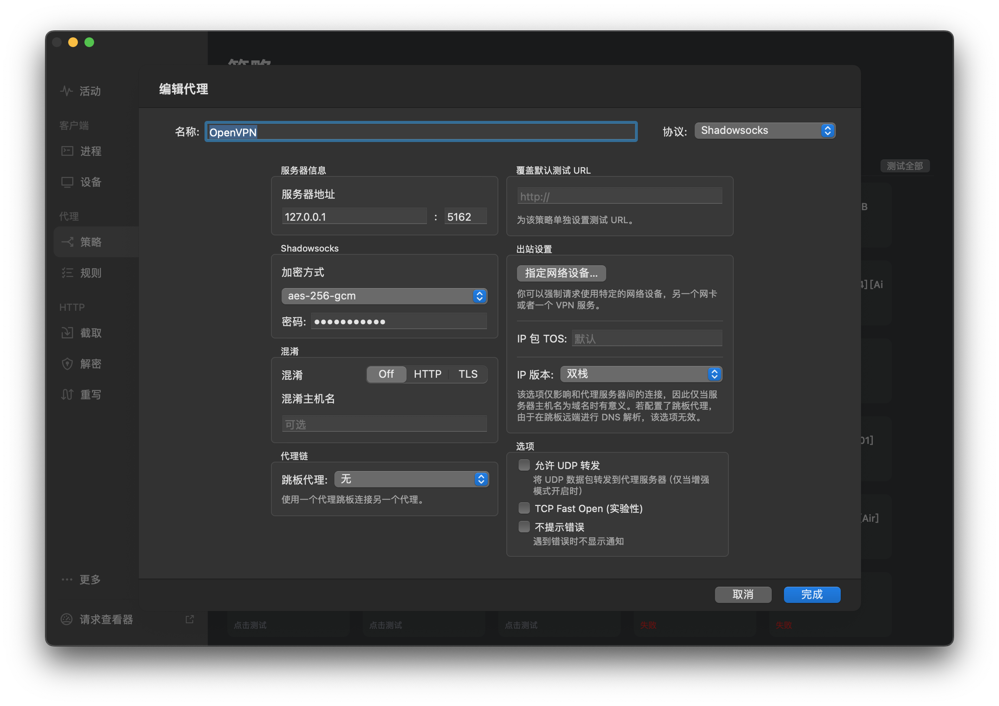

# OpenVPN2SS

> 现代网络环境中，生产或特定网络为确保其网络安全，往往会使用 VPN 网络做接入管制。
>
> 在这种复杂网络环境下，OpenVPN 客户端经常会与 Surge 等网络调试工具存在 DNS 抢占问题。当用户存在多套 OpenVPN 网络时，还需要频繁在不同 OpenVPN 配置间切换，非常繁琐。

OpenVPN2SS 将 OpenVPN 客户端通过 SSServer 转化为 `ss://` 协议，通过支持 `ss://` 协议的网络客户端接入，可有效解决 DNS 抢占、频繁需要切换变更网络的问题。

## 特性

- 支持 OpenVPN 到 Shadowsocks 的协议转换
- 自动健康检查和配置切换功能
  - 定期检查网络连通性（包括 VPN 接口、DNS 解析和网络连接）
  - 当检测到网络异常时自动重试当前配置
  - 在多次重试失败后自动切换到下一个配置
  - 支持多个 OpenVPN 配置文件的循环切换
- 基于 Docker 的容器化部署
- 支持自定义 DNS 配置

## 目录结构

```bash
.
├── Dockerfile                   # 基于 alpine 的镜像源文件，无需改动
├── docker-compose.yml           # Docker Compose 文件
├── docker-entrypoint.sh         # 镜像启动脚本，无需改动
├── config                       # 配置文件目录
│   ├── openvpn                  # OpenVPN 配置文件目录
│   │   ├── ca.crt               # 
│   │   ├── openvpn.ovpn         # 
│   │   ├── pass.txt             # 
│   │   ├── ta.key               # 
│   │   ├── user.crt             # 
│   │   └── user.key             # 
│   └── shadowsocks              # 
│       ├── shadowsocks.json     # 用于被订阅的服务端配置
│       └── shadowsocks.service  # SS 系统文件，无需改动
├── logs                         # OpenVPN 运行日志目录
└── README.md
```

## 使用说明

OpenVPN2SS 基于 `Docker` 设计，支持一键 `docker compose up -d` 运行。运行前请预先配置 **OpenVPN 认证文件**、**SSServer 服务端配置**、**OpenVPN 内网 DNS 地址**。

### 一、OpenVPN 认证配置

在多数 OpenVPN 客户端认证文件中，一般包含 `xxxx.ovpn`、`xxxx.crt`、`xxxx.key`、`ca.crt`、`ta.key` 五个文件。

请按照如下文件名称，将配置文件命名存入 `config/openvpn` 配置目录。

| 文件名称       | 用途说明                                                                                   |
| -------------- | ------------------------------------------------------------------------------------------ |
| `ca.crt`       | 根证书（CA）的公钥证书文件。<br> 用来验证服务器和客户端证书的合法性。                      |
| `openvpn.ovpn` | OpenVPN 配置文件。<br>包含了连接服务器所需的所有配置选项，如服务器地址、端口、加密算法等。 |
| `pass.txt`     | OpenVPN 用户密码文件。<br>用于自动化连接过程中的认证。                                     |
| `ta.key`       | 预共享密钥文件（TLS-Auth 密钥）。<br>它增加了传输数据的安全性，用于验证通信的完整性。      |
| `user.crt`     | 用户的公钥证书文件。<br>用于客户端身份验证和通信加密。                                     |
| `user.key`     | 用户的私钥文件。<br>用于客户端身份验证和通信加密。                                         |

其中：`pass.txt` 对应 OpenVPN 用户密码文件，以保证客户端可以自动连接而不需要手动输入密码。

### 二、SSServer 服务端配置

在 `config/openvpn` 目录下，默认仅需修改 `shadowsocks.json` 文件中的 `password` 字段，其他字段可保持不变。

> 默认配置中采用 `aes-256-gcm` 认证加密算法，在容器内开放 5162 端口，并通过 Docker 对外暴露（依然是 5162 端口不变）。

### 三、构建镜像（可选）

> 本工程已提供 Docker 镜像，可直接通过 DockerHub 获取，你也可以选择自行构建。

```bash
docker-compose build openvpn-client
```

## 四、设定 OpenVPN 内网 DNS，启动运行

多数 OpenVPN 网络内部一般会配套 `CoreDNS` 一类服务发现服务，用于内网的 DNS 分发，但由于 OpenVPN CLI Client 不会自动接管容器中的 DNS 网络，需要在 `docker-compose.yml` 的 `dns` 配置节中进行指定，该段配置支持多个 DNS 服务器指向。以内网 DNS 服务器 IP 为 `10.8.0.1` 为例，参考如下：

```yaml
version: "3"
services:
  openvpn-client:
    container_name: openvpn-client
    ...
    dns:
      - 10.8.0.1
    ...
```

随后就可以启动了，启动命令如下：

```bash
docker compose up -d
```

当你参考下方命令查阅运行日志，看到如下内容，表示 OpenVPN 和 SS 已成功运行。

```bash
# OpenVPN 运行日志，位于 logs/ovpn.log
➜  tail -f logs/ovpn.log
2023-11-01 07:53:49 Data Channel: using negotiated cipher 'AES-256-GCM'
2023-11-01 07:53:49 Outgoing Data Channel: Cipher 'AES-256-GCM' initialized with 256 bit key
2023-11-01 07:53:49 Incoming Data Channel: Cipher 'AES-256-GCM' initialized with 256 bit key
2023-11-01 07:53:49 ROUTE_GATEWAY 172.29.0.1/255.255.0.0 IFACE=eth0 HWADDR=00:00:00:00:00:00
2023-11-01 07:53:49 TUN/TAP device tun0 openeda
2023-11-01 07:53:49 /sbin/ip link set dev tun0 up mtu 1500
2023-11-01 07:53:49 /sbin/ip link set dev tun0 up
2023-11-01 07:53:49 /sbin/ip addr add dev tun0 10.8.0.5/24
2023-11-01 07:53:49 /sbin/ip route add 10.0.64.9/32 via 10.8.0.1
2023-11-01 07:53:49 Initialization Sequence Completed
...
# SS 日志，位于容器运行时日志输出
➜  docker compose logs -f
openvpn-client  | 2023-11-01T11:54:08.534779916+00:00 INFO  shadowsocks server 1.17.0 build 2023-10-15T02:31:43.546559935+00:00
openvpn-client  | 2023-11-01T11:54:08.538587179+00:00 INFO  shadowsocks tcp server listening on 0.0.0.0:5162, inbound address 0.0.0.0:5162
```

### 配置上游网络代理以接入 OpenVPN 网络

接入需要使用支持 `ss://` 协议的网络工具，默认可指向本地 `127.0.0.1` 的 5162 端口，使用 `aes-256-gcm` 认证加密算法，结合上文阶段中配置的 `SSServer` 密码实现认证。以下是 Surge 下配置客户端示例截图：



## 自动切换功能

OpenVPN2SS 内置了智能的网络健康检查和自动切换功能，可以在网络出现问题时自动进行故障转移。

### 工作原理

1. **健康检查机制**
   - 每 30 秒进行一次健康检查
   - 检查项目包括：
     - OpenVPN 接口（tun0）状态
     - DNS 解析功能
     - 网络连通性测试

2. **自动重试和切换逻辑**
   - 当检测到网络异常时：
     - 首先尝试重启当前配置（最多 3 次）
     - 如果重试失败，自动切换到下一个配置文件
     - 所有配置都会被循环使用

3. **配置管理**
   - 支持多个 OpenVPN 配置文件
   - 按字母顺序自动加载和切换
   - 保持配置切换状态，重启后从上次的配置继续

### 使用方法

1. **准备配置文件**
   - 将多个 OpenVPN 配置文件放在 `config/openvpn` 目录下
   - 建议使用有序的命名方式，如：
     ```
     config/openvpn/
     ├── 01.ovpn
     ├── 02.ovpn
     └── 03.ovpn
     ```

2. **确保配置文件完整性**
   - 每个 `.ovpn` 文件都需要对应的证书和密钥文件
   - 确保 `pass.txt` 包含正确的认证信息

3. **监控日志**
   - OpenVPN 日志：`logs/ovpn.log`
   - 容器日志（包含切换信息）：
     ```bash
     docker compose logs -f
     ```

### 配置建议

1. **健康检查参数**
   - 检查间隔：30 秒（可在 docker-compose.yml 中调整）
   - 超时时间：10 秒
   - 启动等待时间：15 秒
   - 重试次数：3 次

2. **网络测试目标**
   - 默认使用 8.8.8.8 和 1.1.1.1 作为连通性测试目标
   - 可以通过修改 `healthcheck.sh` 自定义测试目标

3. **性能优化**
   - 配置切换时会自动重置重试计数
   - 支持优雅关闭，确保服务正常停止
   - 容器自动重启策略：unless-stopped
